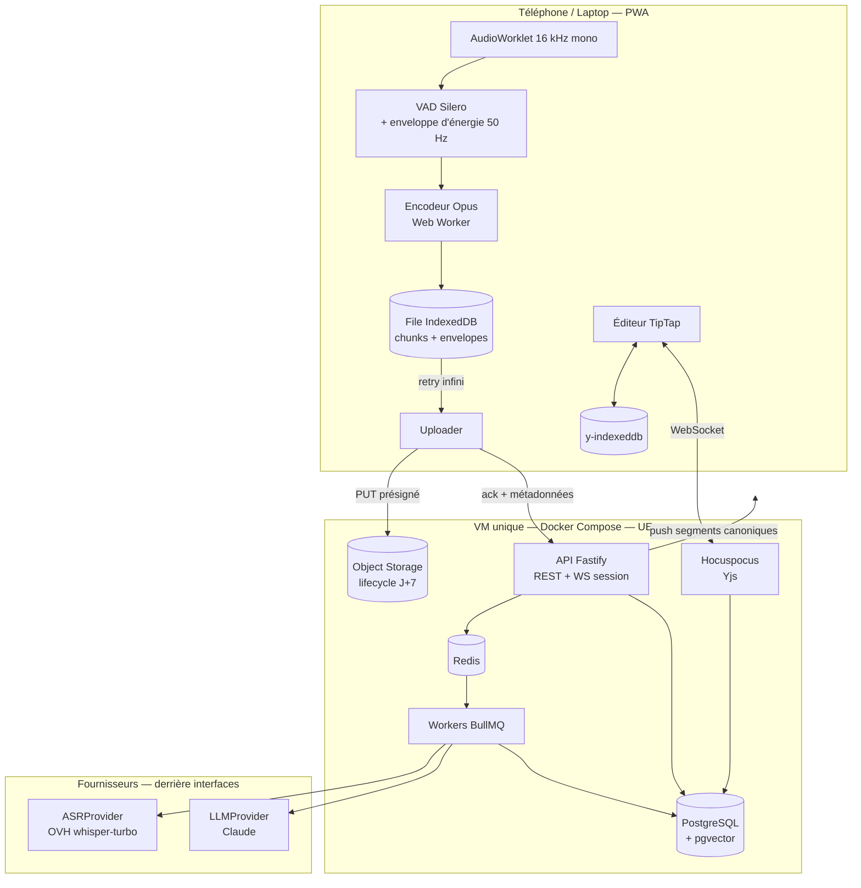
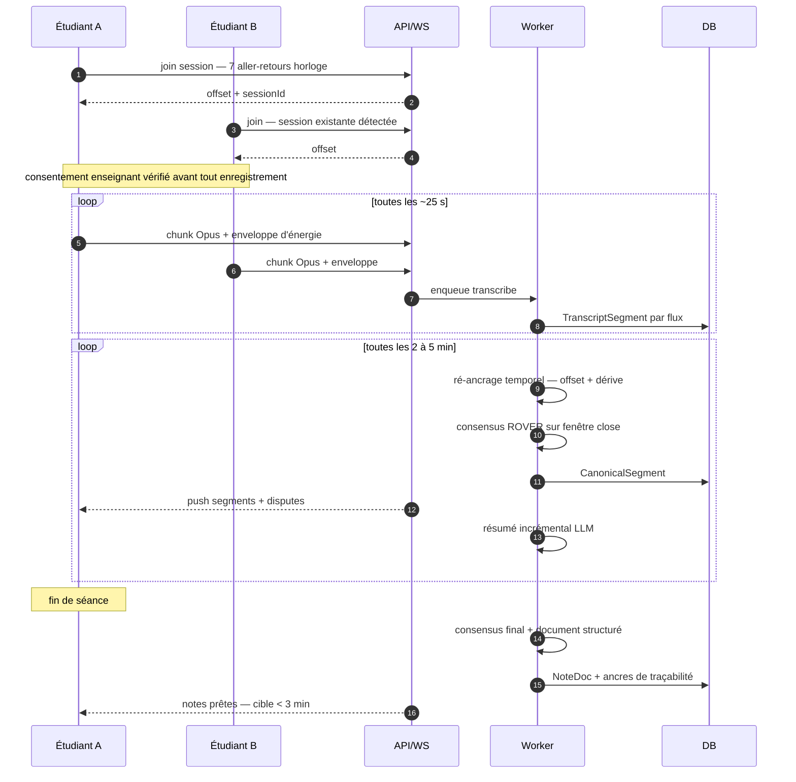
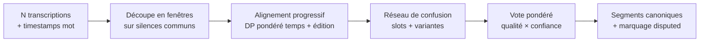

# Amphi — Architecture

> **Statut : PROPOSITION — à valider avant écriture de code applicatif.**
> Rien n'a été codé. Ce document est le livrable du jalon M0.
> Les points où j'ai dû deviner ton intention sont regroupés en **[§14](#14--ce-que-jai-dû-deviner)** — commence peut-être par là.

---

## 0. TL;DR

Une PWA offline-first qui enregistre le cours depuis plusieurs téléphones, transcrit côté serveur, **fusionne les flux** en une transcription canonique, en génère des notes structurées et traçables, éditables en collaboratif.

**Les 6 conclusions qui changent le projet par rapport au brief :**

| # | Conclusion | Impact |
|---|---|---|
| 1 | **OVHcloud AI Endpoints expose `whisper-large-v3-turbo` à 0,046 €/h d'audio**, API OpenAI-compatible, hébergé UE. C'est le même prix que Groq (0,037 €/h) **sans transfert hors UE**. | L'arbitrage RGPD/coût sur l'ASR n'existe pas. Défaut = OVH. Groq reste derrière l'interface comme option de burst. |
| 2 | **Le budget < 20 €/mois est plus contraignant que le < 0,30 €/h.** Le coût par heure est facile à tenir ; c'est le volume (~65 h de cours/mois pour une promo) qui sature. | Introduction de **profils de coût** (Éco par défaut / Équilibré / Qualité à la demande) + un compteur de dépense par session et un plafond mensuel dur. Voir [§11](#11--coûts). |
| 3 | **La sync temporelle décrite au §3.3 du brief (corrélation sur les 60 premières secondes) ne peut pas tenir le critère « < 200 ms après 60 min ».** Les horloges d'échantillonnage audio des téléphones dérivent de 10 à 100 ppm, soit jusqu'à **360 ms/heure** — la dérive est le terme dominant, pas l'offset initial. | Je propose un **ré-ancrage continu** (offset + pente estimés en continu sur toute la séance), pas un calage unique. Voir [§5.1](#51-synchronisation-temporelle). Sans ça, le critère d'acceptation est inatteignable. |
| 4 | **`MediaRecorder` est un piège sur iOS** (pas d'Opus, chunks non décodables indépendamment) et **Safari suspend la capture quand l'écran se verrouille** — or le scénario nominal est « téléphone posé sur la table ». | Capture via **AudioWorklet → PCM → encodage Opus dans un Worker**, chunks autonomes ; + Wake Lock, détection de trous, test réel de 90 min en semaine 1. Voir [§4](#4--capture-audio). C'est le risque n°1 du projet. |
| 5 | **La fusion n'apporte un gain réel qu'à partir de 3 flux.** À 2 flux, ROVER n'a pas de majorité et se réduit à « faire confiance au meilleur flux ». | Le critère « WER canonique < meilleur flux » sera prouvé sur banc synthétique à N=3..5 ; à N=2 l'objectif est le *marquage* des désaccords, pas le gain de WER. Dit franchement dans les tests. |
| 6 | **Les erreurs ASR entre téléphones d'un même amphi sont corrélées** (si le prof est inaudible, tout le monde se trompe pareil). La littérature ROVER donne 10–20 % de réduction relative de WER, pas 50 %. | Le banc de test inclut un mode « erreurs corrélées » qui vérifie la **non-régression**, pas seulement le gain. Ne promettons pas ce qu'on ne tiendra pas. |

---

## 1. Périmètre v1

**Dedans :** capture multi-appareils, ASR serveur, consensus, notes IA traçables, édition collaborative, diagrammes, ICS, recherche, RGPD/suppression, offline.
**Dehors (rappel du brief) :** natif iOS/Android, diarisation nominative, traduction, paiement, multi-établissement.
**Cible :** 10–30 comptes, 1 promo, ~15 h de cours enregistrées par semaine.

Hypothèse dimensionnante : **les étudiants partagent les mêmes cours**. Le coût ne croît donc pas avec le nombre d'utilisateurs mais avec le nombre d'**heures de cours** — sauf pour l'ASR, qui croît avec le nombre de flux transcrits par session. D'où le plafond `K` sur les flux (voir [§5.0](#50-avant-la-fusion--sélection-des-flux)).

---

## 2. Vue d'ensemble

### 2.1 Composants



### 2.2 Flux d'une séance



---

## 3. Décisions d'architecture

Format court : décision, raison, alternative écartée. Les ADR marqués **↯** s'écartent du brief — ce sont les objections argumentées demandées.

| ADR | Décision | Pourquoi |
|---|---|---|
| **01 ↯** | **ASR par défaut = OVHcloud AI Endpoints `whisper-large-v3-turbo`** (0,00001278 €/s, API OpenAI-compatible), Groq en second provider. | Même prix que Groq, hébergement UE, pas de transfert international à documenter. Le brief proposait Groq en premier ; l'écart de prix (0,046 vs 0,037 €/h) ne justifie pas le coût juridique. L'interface `ASRProvider` rend le choix réversible en une ligne de config. |
| **02 ↯** | **Capture via AudioWorklet + encodage Opus côté client**, pas `MediaRecorder`. | Voir [§4](#4--capture-audio). `MediaRecorder` ne produit pas d'Opus sur iOS et ses chunks ne sont pas décodables indépendamment. |
| **03 ↯** | **Ré-ancrage temporel continu** (offset + dérive) au lieu d'un calage unique sur 60 s. | La dérive d'horloge d'échantillonnage domine (jusqu'à 360 ms/h). Sans ça, critère « < 200 ms » non tenable. |
| **04 ↯** | **Une seule VM Docker Compose**, pas de PaaS. Hetzner (Falkenstein, DE) recommandé pour le prix ; Scaleway Paris si tu veux rester strictement sur ta liste (+ ~5 €/mois, budget mensuel dépassé). | Le budget de 20 €/mois ne survit pas à un PaaS. Décision à trancher par toi, voir [§14](#14--ce-que-jai-dû-deviner). |
| **05 ↯** | **API = Fastify dédiée** (`apps/api`), Next.js réduit au front. Les Route Handlers Next ne servent qu'à l'auth. | Les workers, le WS de session et l'API partagent types et connexions ; un seul runtime Node à opérer. Next reste excellent pour la PWA mais n'est pas un bon hôte pour du WS long-vivant et des jobs. |
| **06 ↯** | **Hocuspocus fusionné dans le process `apps/realtime` avec le WS de session** (deux routes, un process). | Le brief prévoyait deux services ; sur 4 Go de RAM, un container en moins compte. Séparables plus tard sans changer le protocole. |
| 07 | **Consensus = package TS pur, sans I/O** (`packages/consensus`), API fonctionnelle `merge(streams, options) → CanonicalTranscript`. | Testable, déterministe, rejouable sur des cas réels archivés. Conforme au brief. |
| 08 | **Postgres auto-hébergé + pgvector**, pas Supabase. | Supabase EU tiendrait, mais on n'utilise ni son auth ni son storage ni ses edge functions ; ça ajoute une dépendance et un coût pour un `pg` qu'on héberge déjà. Drizzle pour les migrations. |
| 09 | **Auth = magic link + allowlist de domaines** (Auth.js), envoi via Scaleway TEM ou Brevo (UE). | Conforme au brief. Pas de mot de passe à gérer, pas de fuite possible. |
| 10 | **Le transcript canonique est écrit uniquement par le serveur** ; seules les *résolutions humaines de dispute* sont des écritures client. | Évite de mettre la transcription dans un CRDT : elle n'a pas de sémantique d'édition concurrente. Les notes, elles, sont bien un CRDT (Yjs). |
| 11 | **Traçabilité par ancres**, pas par confiance : chaque bloc de notes généré porte `sourceSpans: [{startMs, endMs}]` vérifiés à la génération. Un bloc sans ancre valide est rejeté, pas affiché. | Critère d'acceptation n°6. Mécanisme décrit en [§6.3](#63-traçabilité--le-mécanisme). |
| 12 | **Un `SessionEvent` générique dès M1** (type, `at_session_ms`, payload). | Débloque « je n'ai pas compris » (§9 du brief) et les futurs signaux sans migration. Coût aujourd'hui : une table. |

---

## 4. Capture audio

### 4.1 Le problème iOS (risque n°1)

Le scénario nominal du brief — *téléphone posé sur la table pendant 90 minutes* — se heurte à trois limites de Safari :

1. **Pas d'Opus.** `MediaRecorder` sur iOS produit de l'`audio/mp4` (AAC), jamais du `webm/opus`.
2. **Chunks non autonomes.** Avec `start(timeslice)`, seuls le premier blob contient l'en-tête ; les suivants ne sont pas décodables seuls. Un pipeline « 1 chunk = 1 fichier à transcrire » casse.
3. **Suspension en arrière-plan.** Écran verrouillé ou onglet en fond → la capture s'arrête ou devient erratique.

### 4.2 La réponse

```
getUserMedia → AudioContext(16 kHz) → AudioWorklet
                                        ├→ Float32 ring buffer
                                        ├→ VAD Silero (@ricky0123/vad-web)
                                        ├→ enveloppe log-énergie 50 Hz (uint8)
                                        └→ Worker: libopus WASM → Ogg/Opus 24 kbps
                                                     └→ 1 chunk = 1 fichier Ogg complet
```

- **Chunks autonomes** : nouveau flux Ogg à chaque chunk, coupé sur une frontière de silence détectée par le VAD quand il y en a une dans la fenêtre 20–30 s, sinon coupe dure. Chaque chunk est directement transcriptible.
- **Horodatage** : `startedAtSessionMs` dérivé du **compteur d'échantillons** de l'AudioWorklet, pas de `Date.now()`. C'est la base de toute la sync ([§5.1](#51-synchronisation-temporelle)).
- **Débit** : 24 kbps ≈ **11 Mo/heure** par flux. Négligeable en stockage, tolérable en upload dégradé.
- **Enveloppe d'énergie** : 50 valeurs/s en `uint8` ≈ 180 ko/h, uploadée avec le chunk. Elle sert au ré-ancrage temporel **sans jamais retransmettre d'audio** — donc utilisable même en mode « transcription only ».
- **Écran** : `navigator.wakeLock` + bandeau « garde l'app à l'écran », détection des trous (`sampleCount` non contigu → `AudioChunk.gap = true`, signalé dans l'UI et exclu du consensus).
- **Repli** : `MediaRecorder` conservé derrière la même interface pour les navigateurs sans AudioWorklet exploitable.

**Action semaine 1, avant tout code de fusion :** enregistrer 90 min réelles sur 1 iPhone + 1 Android, écran verrouillé et déverrouillé, mesurer les trous. Si iOS s'avère inutilisable écran éteint, le produit doit l'assumer explicitement (« écran allumé, batterie branchée ») — ce n'est pas contournable en PWA.

### 4.3 File d'attente

`AudioChunk` idempotent par `(participantId, seq)`. Upload = PUT présigné vers S3 puis `POST /chunks/ack`. Retry exponentiel plafonné, persistance IndexedDB, reprise au démarrage. Un chunk n'est supprimé du client qu'après ack serveur. Quota IndexedDB surveillé : à 80 %, alerte ; au-delà, on arrête l'enregistrement plutôt que de perdre silencieusement.

---

## 5. Le module consensus

Package `packages/consensus`, TypeScript pur, aucune I/O, aucune dépendance réseau.

### 5.0 Avant la fusion : sélection des flux

Toutes les sessions ne méritent pas 5 transcriptions payantes. À l'ouverture d'une fenêtre, on classe les participants par **score de qualité** et on ne transcrit que les `K` meilleurs (`K = 2` en profil Éco, `3` en Équilibré) :

```
quality = 0.5·z(SNR estimé) + 0.3·z(énergie vocale médiane) + 0.2·(1 − taux de trous)
```

Le SNR est estimé côté client à partir du VAD : rapport entre l'énergie médiane des trames « parole » et celle des trames « silence ». Les flux non retenus continuent d'être enregistrés et stockés (ils servent de secours si un flux retenu tombe), mais ne sont pas envoyés à l'ASR. **C'est le principal levier de coût du projet.**

### 5.1 Synchronisation temporelle

Trois horloges à ne pas confondre :

| Horloge | Dérive typique | Usage |
|---|---|---|
| `Date.now()` client | NTP, sauts possibles | rien de critique |
| Compteur d'échantillons AudioWorklet | 10–100 ppm vs le quartz voisin | **référence locale** |
| Temps de session serveur | référence | cible commune |

**Modèle :** `t_session = a_p · t_audio_local + b_p`, un couple `(a, b)` par participant, ré-estimé en continu.

1. **Amorce (`b` initial)** — 7 aller-retours type Cristian au join : `offset = (t_srv_recv + t_srv_send)/2 − (t_cli_send + t_cli_recv)/2`. On garde la **médiane des 3 échantillons de plus faible RTT** (les RTT élevés sont asymétriques et biaisent). Précision attendue : 20–60 ms en 4G.
2. **Affinage grossier (`b`)** — corrélation croisée normalisée (GCC-PHAT) des **enveloppes d'énergie** entre chaque flux et le flux de référence, sur des fenêtres de 30 s, recherche ±2 s. Résolution 20 ms. Les enveloppes suffisent : pas besoin de chromaprint (conçu pour la musique, peu discriminant sur de la parole en salle).
3. **Dérive (`a`)** — régression linéaire robuste (Theil-Sen) sur les décalages mesurés à l'étape 2 toutes les 5 minutes, plus les **ancres textuelles** : mots rares (`idf` élevé) apparaissant dans deux flux à moins de 2 s d'écart. Rejet des points aberrants par RANSAC.
4. **Contrôle** — l'erreur résiduelle est journalisée par fenêtre ; au-delà de 200 ms, le flux est marqué `desynced` et exclu du vote jusqu'à re-convergence.

*Détail physique assumé :* deux téléphones distants de 20 m dans un amphi reçoivent le son avec ~60 ms d'écart réel (vitesse du son). C'est sous le budget de 200 ms, mais c'est un plancher — inutile de viser mieux que ~30 ms au niveau du mot.

### 5.2 Alignement et vote



1. **Fenêtrage** — on coupe aux instants où *tous* les flux sont en silence (intersection des VAD), typiquement 30–60 s. Borne la complexité du DP et rend le traitement incrémental pendant le cours.
2. **Alignement progressif (ROVER)** — flux triés par qualité décroissante. Le flux 1 initialise le réseau ; chaque flux suivant est aligné sur le réseau courant par programmation dynamique. Coût de substitution :
   `cost(u, v) = α·(1 − sim(u, v)) + β·min(1, |Δt| / Δmax)` avec `Δmax = 800 ms`
   `sim` = similarité de chaînes normalisées (casse, accents, élisions FR) ; deux mots séparés de plus de `Δmax` ne peuvent pas s'aligner. Insertions/suppressions modélisées par un jeton `∅` explicite dans les slots.
3. **Vote** — pour chaque slot :
   `score(v) = Σ_p w_p · c_{p,v} · (1 + γ·bonus_langue)`, `w_p` = poids qualité normalisé, `c` = confiance ASR du mot, `bonus_langue` = petit bonus si la variante appartient au vocabulaire du cours (syllabus, slides, séances précédentes) — c'est le même lexique que le biasing ASR, réutilisé.
   `∅` est une variante comme une autre : c'est ce qui gère les insertions parasites.
4. **Décision** — `consensus = score(v₁) / Σ score`. `is_disputed = consensus < 0,6 OU (score(v₁) − score(v₂)) / score(v₁) < 0,15`. Les variantes concurrentes sont conservées avec leur provenance (`participantId`) pour l'UI.
5. **Reconstruction** — bornes temporelles = médiane des mots contributeurs ; ponctuation et casse reprises du flux de plus fort poids (jamais votées mot à mot, ça produit du charabia).
6. **Dégradé** — `N = 1` : chemin identique, réseau à une branche, `consensus = confiance ASR`, `is_disputed` si confiance < seuil. Aucun code spécifique.

### 5.3 API du package

```ts
export interface StreamTranscript {
  readonly participantId: string;
  readonly quality: QualityScore;        // SNR, énergie vocale, taux de trous
  readonly clock: { readonly a: number; readonly b: number };
  readonly words: readonly Word[];       // { text, startMs, endMs, confidence }
}

export interface ConsensusOptions {
  readonly disputeThreshold: number;     // défaut 0.6
  readonly marginThreshold: number;      // défaut 0.15
  readonly maxAlignmentDeltaMs: number;  // défaut 800
  readonly lexicon?: readonly string[];  // vocabulaire du cours
}

export function merge(
  streams: readonly StreamTranscript[],
  options?: Partial<ConsensusOptions>,
): CanonicalTranscript;                  // segments + slots + variantes + provenance

export function wer(reference: string, hypothesis: string): WerResult;
```

Fonctions pures, `readonly` partout, zéro `any`.

### 5.4 Banc de test

Générateur déterministe (`seed`) : à partir d'un texte de référence FR/EN mélangé, on produit N flux bruités avec taux de substitution/suppression/insertion paramétrables, confusions phonétiques plausibles (`gradient` → `gradiant`, `L2` → `Elle deux`), gigue de timestamps, offset et dérive d'horloge.

Assertions :

| Test | Attendu |
|---|---|
| `N=3..5`, erreurs **indépendantes** | `WER(consensus) < min_p WER(p)` sur ≥ 19 seeds / 20, gain relatif moyen **rapporté dans la sortie de test** |
| `N=2` | pas de régression vs le meilleur flux ; ≥ 80 % des vraies divergences marquées `disputed` |
| `N=1` | sortie strictement identique à l'entrée |
| Erreurs **corrélées** (même erreur injectée dans tous les flux) | **non-régression** : `WER(consensus) ≤ WER(meilleur) + 0,5 pt`. C'est le cas réaliste en amphi. |
| Dérive d'horloge 100 ppm sur 60 min | résiduel < 200 ms après ré-ancrage ; sans ré-ancrage, le test doit échouer (preuve que l'ADR-03 sert à quelque chose) |

Le gain de WER est **imprimé par le test**, pas seulement asserté :
`consensus: WER 14.2% | best single: 17.8% | gain 20.2% relatif (N=4, 20 seeds)`

**Honnêteté requise :** un banc synthétique à erreurs indépendantes valide l'algorithme, pas le gain réel. La validation réelle, c'est un cours enregistré à 4 téléphones, transcrit à la main sur 10 minutes, mesuré. À planifier en M3.

---

## 6. Notes générées

### 6.1 Pendant le cours

Toutes les N minutes (N = 5 en Éco, 3 en Équilibré — c'est un curseur de coût, pas une constante), un appel LLM :
*entrée* = résumé courant + segments canoniques nouveaux + plan des slides s'il existe ; *sortie* = résumé mis à jour + points saillants + termes nouveaux. Affiché dans un panneau latéral « fil du cours », jamais injecté dans le document.

### 6.2 En fin de séance

Un appel produit un document structuré en JSON validé par zod (plan H1/H2/H3, définitions, formules LaTeX, encadrés `À retenir`/`Exemple`/`Attention`, questions ouvertes, points marqués incompris), converti en nœuds ProseMirror. Sortie contrainte par `output_config.format` (structured outputs) — pas de parsing de markdown au petit bonheur.

### 6.3 Traçabilité — le mécanisme

C'est le point le plus important du §3.4 du brief, et il ne se règle pas par un prompt.

1. Les segments canoniques sont numérotés `[s0] [s1] …` dans le prompt.
2. Le schéma de sortie **impose** `sourceSegmentIds: string[]` non vide sur chaque bloc.
3. **Vérification post-génération** : pour chaque bloc, on contrôle que les IDs existent et qu'il y a un recouvrement lexical minimal entre le bloc et le texte cité (Jaccard sur les termes pleins ≥ seuil). Un bloc qui ne passe pas est **écarté**, pas affiché, et compté dans une métrique `unanchoredBlockRate` visible en debug.
4. L'UI rend l'ancre comme un lien cliquable → lecteur de transcript positionné à `start_ms`.

Un bloc affiché est donc toujours rattaché à un passage réellement prononcé. C'est ce qui rend l'outil utilisable pour réviser.

### 6.4 Anti-écrasement

Les blocs IA arrivent en **suggestions** (marque ProseMirror `suggestion`, décorations distinctes) : accepter / modifier / rejeter. Une génération ne modifie jamais un nœud dont l'attribut `authoredBy` est humain. Règle dure, testée.

---

## 7. Collaboration et offline

| Donnée | Mécanisme | Conflit |
|---|---|---|
| Notes | Yjs + `y-indexeddb` + Hocuspocus | CRDT — pas de conflit par construction |
| Chunks audio | File IndexedDB, idempotence `(participant, seq)` | rejeu sans doublon |
| Transcript canonique | Écriture serveur seule, push incrémental, curseur de reprise | pas d'écriture cliente |
| Résolution de dispute | Table append-only, LWW sur `(resolvedAt, userId)` | trace conservée, réversible |
| Métadonnées de session | REST + revalidation | dernier écrivain gagne, champs disjoints |

Service worker (Workbox) : app shell précaché, données en `stale-while-revalidate`, écran « hors ligne » explicite avec l'état de la file. **Test Playwright dédié** : couper le réseau, enregistrer 3 min, éditer les notes, rétablir, vérifier zéro perte et zéro doublon. C'est le critère d'acceptation n°4, il mérite un test end-to-end, pas une vérification manuelle.

Persistance Yjs : document binaire en base + snapshot toutes les 200 mises à jour et à chaque fin de session, pour l'historique et la restauration.

---

## 8. Rattachement aux cours

Interface `LMSProvider` — trois implémentations, dans l'ordre du brief :

1. **`ICSProvider` (M4, obligatoire)** — l'utilisateur colle l'URL iCal, `node-ical` parse, on crée les `Course` et les créneaux. Rattachement automatique d'une session au cours dont le créneau couvre `startedAt` (+ salle si présente). Ambiguïté → l'utilisateur tranche, le choix est mémorisé par `ics_uid`.
2. **`FileContextProvider` (M5)** — dépôt de slides/PDF, extraction texte, découpe, embeddings pgvector. Sert deux usages : biasing ASR (termes rares du cours injectés dans le prompt Whisper) et alignement du plan des notes.
3. **`BrightspaceProvider` (optionnel, non planifié)** — D2L Valence / LTI 1.3, activable par config. **Aucune fonctionnalité n'en dépend.** Sans App Key de l'établissement, l'app fonctionne à 100 %.

---

## 9. Modèle de données

Les entités du brief, plus les ajouts nécessaires (marqués **+**).

```
User(id, email, name, school, created_at)
Course(id, title, code, instructor, lms_ref, ics_uid, lexicon jsonb+)
Session(id, course_id, started_at, ended_at, room, status, cost_cents+, profile+)
Participant(session_id, user_id, role, device_label, clock_a+, clock_b+,
            audio_quality_score, is_transcribed+, state+)
AudioChunk(id, participant_id, seq, started_at_session_ms, duration_ms,
           storage_key, status, delete_after, has_gap+, envelope bytea+)
TranscriptSegment(id, session_id, participant_id, start_ms, end_ms, text,
                  confidence, tokens jsonb, lang+)
CanonicalSegment(id, session_id, start_ms, end_ms, text, consensus_score,
                 is_disputed, variants jsonb, resolved_by_user_id, resolved_at+)
NoteDoc(id, session_id, ydoc bytea, updated_at)
NoteSnapshot(id, note_doc_id, ydoc bytea, created_at, label)
Attachment(id, session_id, type, storage_key, extracted_text, embedding)
Embedding(source_type, source_id, vector)

+ ConsentRecord(id, session_id, subject, method, granted_by, granted_at,
                scope, revoked_at, evidence jsonb)
+ SessionEvent(id, session_id, user_id, type, at_session_ms, payload jsonb)
+ CostLedger(id, session_id, provider, kind, units, cost_cents, at)
+ DeletionRequest(id, user_id, requested_at, completed_at, scope)
```

Notes :
- `clock_a`/`clock_b` remplacent `clock_offset_ms` : il faut la pente, pas seulement l'offset (ADR-03).
- `envelope` sur `AudioChunk` : permet le ré-ancrage même après suppression de l'audio.
- `CostLedger` : sans lui, le budget mensuel n'est pas pilotable — on le découvrirait sur la facture.
- `SessionEvent` : socle du « je n'ai pas compris » (§9 du brief) sans migration future.

Index clés : `CanonicalSegment(session_id, start_ms)`, `AudioChunk(participant_id, seq)` unique, GIN sur `to_tsvector('french', text)`, HNSW sur les vecteurs.

---

## 10. RGPD, consentement, droit d'auteur

> Je ne suis pas juriste et ceci n'est pas un avis juridique. Le dispositif ci-dessous vise à rendre l'usage défendable et à donner à l'école de quoi dire oui.

**Deux sujets distincts, souvent confondus :**

- **RGPD** — la voix de l'enseignant est une donnée personnelle. Base légale la plus propre ici : **le consentement de l'enseignant**, recueilli et horodaté.
- **Droit d'auteur** — le cours est une œuvre. L'enregistrer pour son usage personnel est une chose ; le diffuser en est une autre. Garde-fou technique : pas de partage public, périmètre limité à la promo, exports marqués.

**Dispositif technique :**

| Exigence | Implémentation |
|---|---|
| Consentement à la première utilisation dans une salle | Écran bloquant. La session affiche un **code à 4 chiffres** ; le prof valide depuis son propre téléphone (`/consent/<code>`) → `ConsentRecord` horodaté. Repli : « déclaré par l'étudiant » avec accord écrit joint. |
| Pas de consentement | **Aucun `AudioChunk` n'est créé.** Mode « notes seules » : édition collaborative sans micro. C'est un verrou serveur, pas une case à cocher UI. |
| Révocation | Le prof rouvre le lien → révocation → purge en cascade de la session (audio, transcripts, canoniques ; les notes rédigées à la main sont conservées, sans citations). |
| Mode « transcription only » (**défaut**) | L'audio est transcrit puis supprimé du bucket dans la foulée (`delete_after = now`). Seules l'enveloppe d'énergie et la transcription survivent. Rétention audio = opt-in explicite, plafonnée à J+7 par lifecycle S3. |
| Suppression en un clic | `DeletionRequest` → job qui purge chunks, segments, participations, contributions Yjs de l'utilisateur, embeddings, et anonymise les traces. Rapport de suppression affiché. Testé. |
| Données en UE | Postgres + S3 + ASR (OVH) en UE. **Le LLM est le seul maillon hors UE** : Anthropic (US) sous DPA + CCT. Alternative 100 % UE derrière `LLMProvider` : Mistral (Paris) ou Claude via Bedrock `eu-central-1`. À trancher par toi ([§14](#14--ce-que-jai-dû-deviner)). |

À produire hors code : un **registre de traitement** d'une page, une **note d'information** pour les enseignants, et un responsable de traitement désigné. Le meilleur usage de ces trois pages, c'est de les envoyer au DPO de l'école avant de commencer, pas après.

---

## 11. Coûts

Hypothèses : 1 h de cours ≈ 9 000 mots ≈ 15 000 tokens de transcript. 1 USD = 0,92 EUR. Tarifs vérifiés le 2026-09-07.

### 11.1 Prix unitaires

| Poste | Prix | Source |
|---|---|---|
| ASR OVH `whisper-large-v3-turbo` | 0,00001278 €/s = **0,046 €/h d'audio** | catalogue OVHcloud |
| ASR Groq `whisper-large-v3-turbo` | 0,04 $/h = **0,037 €/h** (facturation min. 10 s/requête) | tarifs Groq |
| Claude Haiku 4.5 | 1 $ / 5 $ par M tokens (in/out) | tarifs Anthropic |
| Claude Sonnet 5 | 3 $ / 15 $ par M tokens | tarifs Anthropic |
| Claude Opus 5 | 5 $ / 25 $ par M tokens | tarifs Anthropic |
| VM Hetzner CX22 (2 vCPU, 4 Go) | **3,79 €/mois** | tarifs Hetzner |
| Object storage + domaine | ≈ 2 €/mois | estimation |

### 11.2 Coût d'une heure de cours

| Poste | Éco (défaut) | Équilibré | Qualité (à la demande) |
|---|---|---|---|
| ASR | 2 flux → 0,092 € | 2 flux → 0,092 € | 3 flux → 0,138 € |
| Résumés incrémentaux | Haiku, /5 min → 0,033 € | Haiku, /3 min → 0,054 € | Haiku, /2 min → 0,081 € |
| Document final | Haiku → 0,040 € | Sonnet 5 → 0,119 € | Opus 5 → 0,198 € |
| Embeddings + stockage | 0,010 € | 0,010 € | 0,010 € |
| **Total** | **0,175 €/h** ✅ | **0,275 €/h** ✅ | **0,427 €/h** ⚠️ |

Les trois profils tiennent le critère « < 0,30 €/h » sauf le mode Qualité, qui est **déclenché à la main** (bouton « régénérer en qualité maximale ») sur les cours qui comptent — typiquement avant les partiels.

### 11.3 Le vrai plafond : le mois

Base : 15 h de cours enregistrées/semaine ≈ **65 h/mois**.

| Scénario | Variable | Fixe | Total |
|---|---|---|---|
| Tout en Éco | 11,40 € | 5,79 € | **17,19 €** ✅ |
| Tout en Équilibré | 17,90 € | 5,79 € | **23,69 €** ❌ |
| Éco + 15 régénérations Qualité/mois | 11,40 € + 6,40 € | 5,79 € | **23,59 €** ❌ |
| Éco + VM Scaleway au lieu de Hetzner | 11,40 € | ~11 € | **~22,40 €** ❌ |

**Conclusion : Éco par défaut, sur Hetzner, tient le budget avec ~3 € de marge. Tout le reste le dépasse.** D'où :

- **`CostLedger`** alimenté à chaque appel provider, tableau de bord €/session et €/mois ;
- **plafond mensuel dur** configurable : à 80 % alerte, à 100 % on bascule tout en Éco et on désactive la régénération Qualité ;
- le choix du profil est **par cours** — « Statistiques inférentielles » mérite peut-être Équilibré, pas « Introduction au droit ».

**Levier de secours si le budget se tend :** `faster-whisper large-v3-turbo` auto-hébergé fait tomber l'ASR à 0 € marginal (~55 % du coût variable). Viable si tu as une machine qui tourne déjà — à confirmer, voir [§14](#14--ce-que-jai-dû-deviner).

---

## 12. Risques

| # | Risque | Gravité | Mitigation | Quand on saura |
|---|---|---|---|---|
| R1 | **iOS coupe l'enregistrement écran verrouillé** | 🔴 Critique — casse le scénario nominal | Wake Lock, détection de trous, consigne explicite, repli sur un flux Android | Test réel semaine 1 |
| R2 | **Acoustique d'amphi** : téléphone à 20 m d'un prof sans micro → WER > 40 %, aucune fusion ne rattrape ça | 🔴 Critique | Sélection des flux par SNR, alerte « qualité insuffisante » en direct, encourager un téléphone au 1er rang | Premier vrai cours |
| R3 | **Erreurs corrélées** → gain de fusion faible | 🟠 | Test de non-régression, honnêteté sur la promesse | M3 |
| R4 | **Consentement refusé par les profs** | 🟠 | Mode « notes seules » utile en soi ; approcher le DPO en amont | Dès maintenant |
| R5 | **Budget dépassé** | 🟠 | `CostLedger` + plafond dur + profils | Semaine 1 d'usage |
| R6 | Dérive d'horloge non maîtrisée | 🟡 | ADR-03, test dédié | M3 |
| R7 | Slop LLM non traçable | 🟡 | Vérification d'ancres avec rejet ([§6.3](#63-traçabilité--le-mécanisme)) | M1 |
| R8 | Batterie / chauffe sur 4 h de cours | 🟡 | 16 kHz mono, VAD, écran mis en veille douce si possible | Test semaine 1 |
| R9 | ICS Brightspace absent ou inexploitable | 🟡 | Saisie manuelle des cours en repli | M4 |
| R10 | VM unique = SPOF | 🟢 | Sauvegardes chiffrées quotidiennes + restauration testée ; le client garde tout en local | — |

---

## 13. Jalons

Chaque jalon : démo-able, testé (Vitest domaine + Playwright parcours critique), README de lancement, entrée CHANGELOG.

| Jalon | Contenu | Démo | Critères d'acceptation couverts |
|---|---|---|---|
| **M0** | Ce document | — | — |
| **M1** | Mono-appareil : capture → ASR → notes → lecture avec timestamps cliquables. Auth, consentement, suppression, ledger de coût. | *Un cours réel enregistré, notes lisibles en < 3 min.* | 1, 5, 6 |
| **M2** | TipTap + Yjs + Hocuspocus, présence, suggestions IA, Mermaid, Excalidraw, `/diagram`, offline complet | *Deux laptops éditent la même page, réseau coupé puis rétabli.* | 4 |
| **M3** | Multi-appareils : sync horloge, `packages/consensus`, UI des désaccords, arbitrage humain diffusé | *4 téléphones, WER mesuré, gain affiché par les tests.* | 2, 3 |
| **M4** | ICS, rattachement automatique, recherche full-text + sémantique | *« Où le prof a parlé de la régularisation L2 ? »* | — |
| **M5** | Slides/photos + OCR, flashcards, exports Markdown / PDF / Anki | *Deck Anki importé depuis un cours.* | — |

M1 est le jalon qui compte : à la fin de M1 l'app est utilisable en cours tous les jours, même si rien d'autre n'est fait.

**Structure du dépôt** (conforme au brief, `apps/api` ajouté par ADR-05) :

```
apps/web          apps/api          apps/realtime     apps/worker
packages/consensus  packages/shared   packages/db
```

---

## 14. Ce que j'ai dû deviner

Rien de ce qui suit n'est décidé. Ce sont les endroits où j'ai avancé sur une hypothèse plutôt que de m'arrêter.

| # | Hypothèse prise | Impact si fausse |
|---|---|---|
| 1 | **Nom `amphi`**, dossier `/Users/leo/amphi` | Cosmétique — un `git mv` |
| 2 | **Hetzner (Falkenstein, DE)** plutôt que Scaleway/OVH pour la VM. Hetzner est en UE et fournit un DPA, mais n'était pas dans ta liste. C'est ce qui fait tenir les 20 €/mois. | Structurant sur le budget : Scaleway → ~22–24 €/mois. **À trancher.** |
| 3 | **Le LLM reste Anthropic (US) sous DPA/CCT**, seul maillon hors UE. Alternative 100 % UE : Mistral, ou Claude via Bedrock `eu-central-1`. | Structurant côté conformité, mineur côté code (interface `LLMProvider`). **À trancher.** |
| 4 | **Profil Éco par défaut** (Haiku pour le document final). Le guide Anthropic recommande Opus par défaut ; je propose l'inverse **uniquement** parce que tu as posé un budget dur. La qualité des notes est le cœur du produit — si 24 €/mois passent, Équilibré est nettement meilleur. | C'est ton arbitrage, pas le mien. |
| 5 | **~15 h de cours enregistrées/semaine, ~65 h/mois.** Toute la projection budgétaire en dépend. | Si c'est 25 h/semaine, même Éco dépasse le budget |
| 6 | **Domaines mail** de l'allowlist : je n'ai mis aucune valeur en dur, à remplir (`@etu.ec-lyon.fr` ? `@edu.emlyon.com` ?) | Bloquant pour l'auth en M1 |
| 7 | **Interface en français**, contenu FR/EN mélangé | Faible |
| 8 | **`K = 2` flux transcrits** en profil Éco. C'est le levier de coût principal, mais c'est aussi le minimum où la fusion n'apporte presque rien (conclusion n°5). | Tension réelle entre budget et intérêt technique du §3.3. Je propose : Éco au quotidien, `K = 3+` sur les sessions où on veut vraiment tester la fusion. |
| 9 | **Tu as peut-être une machine qui tourne déjà** (Proxmox / Mac allumé) pour héberger `faster-whisper` et supprimer 55 % du coût variable. Je n'ai rien supposé de tel dans les chiffres. | Si oui, le budget se détend beaucoup et Équilibré devient le défaut |
| 10 | **Responsable de traitement RGPD** = toi ou une association étudiante — non déterminé. | Nécessaire avant le premier enregistrement réel |
| 11 | **Cadence des résumés incrémentaux** : le brief dit 2 min, j'en fais un curseur de coût (2/3/5 min selon profil). | Faible, réglable |
| 12 | **Excalidraw et Mermaid stockés dans le document Yjs** (Excalidraw en scène JSON dans un nœud), pas comme entités séparées. | Faible |

---

## 15. Prochaine étape

Ce que j'attends de toi pour démarrer M1 :

1. **Valide ou corrige** les six conclusions du [§0](#0-tldr) et les ADR marqués **↯**.
2. **Trois arbitrages** te reviennent : hébergeur (#2), LLM UE ou non (#3), profil de coût par défaut (#4).
3. **Deux informations** : les domaines mail de l'école (#6) et une estimation d'heures de cours/semaine (#5).

Dès que c'est tranché, M1 commence par le point le plus risqué et non par le plus facile : **le test de capture 90 minutes sur iPhone écran verrouillé**. Si ce test échoue, le produit change de forme, et il vaut mieux le savoir avant d'écrire le pipeline de consensus.

---

*Document généré le 2026-09-07. Tarifs ASR/LLM/VM vérifiés à cette date — à re-vérifier avant tout engagement.*

**Sources tarifaires :**
[OVHcloud AI Endpoints — whisper-large-v3-turbo](https://www.ovhcloud.com/en/public-cloud/ai-endpoints/catalog/whisper-large-v3-turbo/) ·
[Groq — pricing 2026](https://www.cloudzero.com/blog/groq-pricing/) ·
[Whisper API pricing comparison](https://tokenmix.ai/blog/whisper-api-pricing) ·
[Hetzner — nouvelles offres CX](https://www.hetzner.com/pressroom/new-cx-plans/) ·
[Hetzner vs Scaleway](https://getdeploying.com/hetzner-vs-scaleway)
