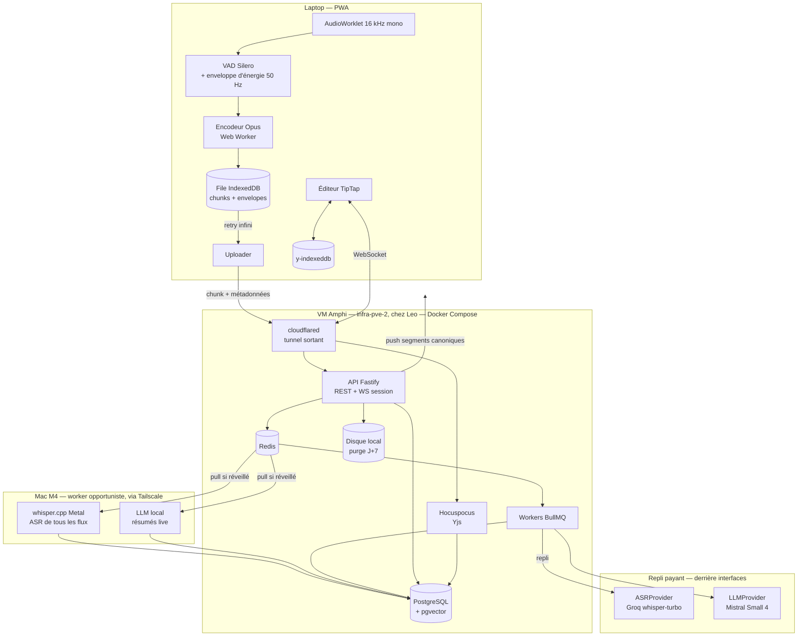
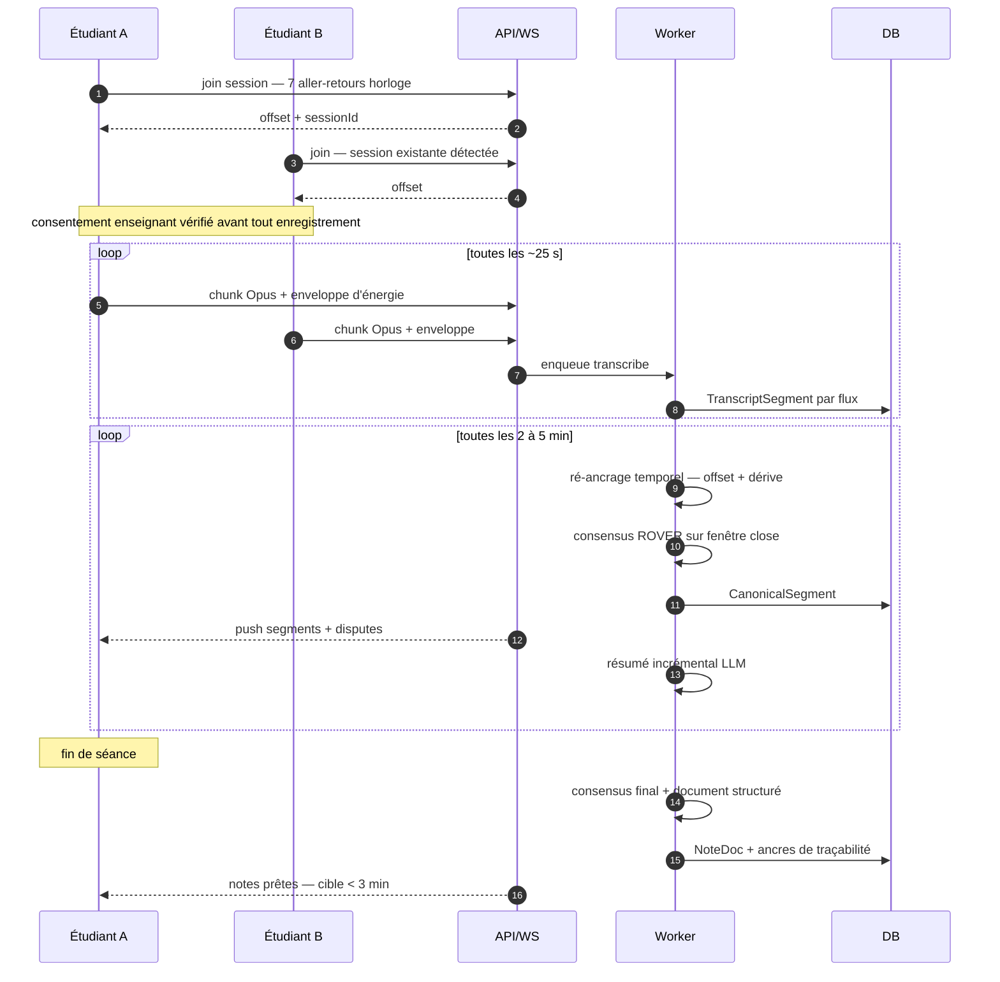
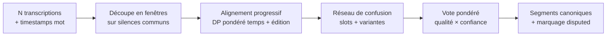

# Amphi — Architecture

> **Statut : VALIDÉ le 2026-09-08. M1 en cours.**
> Ce document reste la référence : les décisions y sont tenues à jour au fur et à mesure des mesures réelles.
> Les chiffres mesurés — et non plus estimés — sont en **[§11.7](#117-mesures-réelles)**.

---

## 0. TL;DR

Une PWA offline-first qui enregistre le cours depuis plusieurs laptops de la promo, transcrit localement, **fusionne les flux** en une transcription canonique, en génère des notes structurées et traçables, éditables en collaboratif.

**Les 7 conclusions qui changent le projet par rapport au brief :**

| # | Conclusion | Impact |
|---|---|---|
| 1 | **L'app tourne sur ton propre matériel** : une VM dédiée sur `infra-pve-2`, qui tourne déjà 24/7 pour schedual. Coût marginal en électricité ≈ 0. Exposition par un **tunnel Cloudflare dédié** — ta ligne est en CGNAT, aucun port-forwarding n'est possible. | Plus de VM louée, plus d'object storage payant, plus d'arbitrage Hetzner/Scaleway. Voir [§11](#11-coûts). |
| 2 | **La bonne machine pour l'IA, c'est ton MacBook, pas tes serveurs.** Mesuré : le M4 transcrit à **9,9× le temps réel** (Whisper large-v3-turbo, MLX/Metal), là où les ProLiant de 2012 (Xeon E5, DDR3, sans GPU) sont un ordre de grandeur en dessous pour quatre fois la consommation. Et il est déjà dans l'amphi : c'est la machine sur laquelle tu prends des notes. | **Worker ASR local sur ton Mac** (ADR-15), repli payant quand il dort. La règle générale : *héberger* l'app sur une machine déjà allumée coûte quelques watts, donc rien ; *inférer* sature un CPU pendant des heures, donc c'est facturé — par EDF au lieu d'un fournisseur d'API, et à chaque mesure EDF est plus cher. |
| 3 | **Le budget final est de ~2,80 €/mois, et la fusion redevient le comportement par défaut.** L'ASR local rend `K` gratuit, et sous Haiku 4.5 les modèles se tiennent à 22 centimes par mois d'écart — le prix cesse d'être le critère. | **Fusion à 3 flux sur toutes les heures**, résumés live, document final par **Mistral Small 4** (ADR-16). Le chiffre que tu avais validé, 7,16 €/mois, devient le **pire cas** — Mac éteint tout le mois — au lieu du cas nominal. Voir [§11](#11-coûts). |
| 4 | **La sync temporelle décrite au §3.3 du brief (corrélation sur les 60 premières secondes) ne peut pas tenir le critère « < 200 ms après 60 min ».** Les horloges d'échantillonnage audio des téléphones dérivent de 10 à 100 ppm, soit jusqu'à **360 ms/heure** — la dérive est le terme dominant, pas l'offset initial. | Je propose un **ré-ancrage continu** (offset + pente estimés en continu sur toute la séance), pas un calage unique. Voir [§5.1](#51-synchronisation-temporelle). Sans ça, le critère d'acceptation est inatteignable. |
| 5 | ~~**`MediaRecorder` est un piège sur iOS.**~~ **Corrigé le 2026-09-08 : il n'y a pas d'iPhone, la capture se fait depuis le laptop.** Toute la complexité prévue — AudioWorklet, Wake Lock, détection de trous, chunks Opus autonomes — existait pour contourner la suspension de Safari sur iOS. Sur macOS, ce problème n'existe pas. | **Le risque n°1 du projet disparaît.** M1 capture avec `MediaRecorder` dans le navigateur du Mac, ce qui suffit. Le chemin AudioWorklet redevient nécessaire en **M3** seulement, et pour une autre raison : l'enveloppe d'énergie du ré-ancrage temporel exige un accès au PCM. Voir [§4](#4--capture-audio). |
| 6 | **La fusion n'apporte un gain réel qu'à partir de 3 flux.** À 2 flux, ROVER n'a pas de majorité et se réduit à « faire confiance au meilleur flux ». | Le critère « WER canonique < meilleur flux » sera prouvé sur banc synthétique à N=3..5 ; à N=2 l'objectif est le *marquage* des désaccords, pas le gain de WER. Dit franchement dans les tests. |
| 7 | **Les erreurs ASR entre téléphones d'un même amphi sont corrélées** (si le prof est inaudible, tout le monde se trompe pareil). La littérature ROVER donne 10–20 % de réduction relative de WER, pas 50 %. | Le banc de test inclut un mode « erreurs corrélées » qui vérifie la **non-régression**, pas seulement le gain. Ne promettons pas ce qu'on ne tiendra pas. |

---

## 1. Périmètre v1

**Dedans :** capture multi-appareils, ASR serveur, consensus, notes IA traçables, édition collaborative, diagrammes, ICS, recherche, RGPD/suppression, offline.
**Dehors (rappel du brief) :** natif iOS/Android, diarisation nominative, traduction, paiement, multi-établissement.
**Cible :** 10–30 comptes, 1 promo, **~30 h de cours par semaine** (≈ 130 h/mois). Capture **depuis les laptops** — pas de téléphone dans le scénario nominal.

Hypothèse dimensionnante : **les étudiants partagent les mêmes cours**. Le coût ne croît donc pas avec le nombre d'utilisateurs mais avec le nombre d'**heures de cours** — sauf pour l'ASR, qui croît avec le nombre de flux transcrits par session. D'où le plafond `K` sur les flux (voir [§5.0](#50-avant-la-fusion--sélection-des-flux)).

---

## 2. Vue d'ensemble

### 2.1 Composants



### 2.2 Flux d'une séance



---

## 3. Décisions d'architecture

Format court : décision, raison, alternative écartée. Les ADR marqués **↯** s'écartent du brief — ce sont les objections argumentées demandées.

| ADR | Décision | Pourquoi |
|---|---|---|
| **01** | **ASR : `whisper.cpp` local sur le Mac en premier, Groq `whisper-large-v3-turbo` en repli** (0,037 €/h), OVH (0,046 €/h, UE) en troisième. | Whisper est une commodité : le modèle local et le modèle payant sont le même modèle, l'auto-hébergement ne coûte donc rien en qualité. Voir ADR-15 pour le worker. Le repli garde le service utilisable quand le Mac dort. |
| **02 ↯** | **Capture via AudioWorklet + encodage Opus côté client**, pas `MediaRecorder`. | Voir [§4](#4--capture-audio). `MediaRecorder` ne produit pas d'Opus sur iOS et ses chunks ne sont pas décodables indépendamment. |
| **03 ↯** | **Ré-ancrage temporel continu** (offset + dérive) au lieu d'un calage unique sur 60 s. | La dérive d'horloge d'échantillonnage domine (jusqu'à 360 ms/h). Sans ça, critère « < 200 ms » non tenable. |
| **04 ↯** | **VM dédiée sur `infra-pve-2`** (Proxmox de Leo), Docker Compose, **pas d'hébergeur loué**. Exposition par un **tunnel Cloudflare dédié** et un hostname propre — pas via le tunnel ni le load-balancer de schedual. | Le host tourne déjà 24/7 pour schedual : coût marginal ≈ 0. VM séparée et non la VM 102, parce que celle-ci sert un client payant (EPBI), a déjà un runbook de crise, et qu'un bug d'Amphi ne doit pas pouvoir devenir un CODE ROUGE. Tunnel séparé pour la même raison côté ingress. Le port-forwarding est de toute façon impossible (CGNAT + double NAT). |
| **05 ↯** | **Stockage = système de fichiers local** derrière une interface `StorageProvider`, plus d'object storage S3. | 11 Mo/h/flux : une année complète à 3 flux tient sur 26 Go. Un service en moins, un coût en moins. L'interface garde la porte ouverte vers Scaleway Object Storage si le volume changeait d'ordre de grandeur. |
| **06 ↯** | **API = Fastify dédiée** (`apps/api`), Next.js réduit au front. Les Route Handlers Next ne servent qu'à l'auth. | Les workers, le WS de session et l'API partagent types et connexions ; un seul runtime Node à opérer. Next reste excellent pour la PWA mais n'est pas un bon hôte pour du WS long-vivant et des jobs. |
| **07 ↯** | **Hocuspocus fusionné dans le process `apps/realtime` avec le WS de session** (deux routes, un process). | Le brief prévoyait deux services ; un container en moins sur un host partagé avec la prod, ça compte. Séparables plus tard sans changer le protocole. |
| 08 | **Consensus = package TS pur, sans I/O** (`packages/consensus`), API fonctionnelle `merge(streams, options) → CanonicalTranscript`. | Testable, déterministe, rejouable sur des cas réels archivés. Conforme au brief. |
| 09 | **Postgres auto-hébergé + pgvector**, pas Supabase. | Supabase EU tiendrait, mais on n'utilise ni son auth ni son storage ni ses edge functions ; ça ajoute une dépendance et un coût pour un `pg` qu'on héberge déjà. Drizzle pour les migrations. |
| 10 ↯ | **Auth = magic link + liste d'invités** (Auth.js) : un admin ajoute les adresses, seules celles-là peuvent se connecter. Filtre par domaine disponible en option, non requis. | Le brief demandait une allowlist de domaine. Pour 30 personnes, une liste nominative est **à la fois plus simple et plus stricte**, et elle fonctionne quel que soit le domaine des camarades (Centrale, emlyon, perso). Un domaine autorise aussi les 3 000 autres étudiants de l'école ; une liste, non. |
| 11 | **Le transcript canonique est écrit uniquement par le serveur** ; seules les *résolutions humaines de dispute* sont des écritures client. | Évite de mettre la transcription dans un CRDT : elle n'a pas de sémantique d'édition concurrente. Les notes, elles, sont bien un CRDT (Yjs). |
| 12 | **Traçabilité par ancres**, pas par confiance : chaque bloc de notes généré porte `sourceSpans: [{startMs, endMs}]` vérifiés à la génération. Un bloc sans ancre valide est rejeté, pas affiché. | Critère d'acceptation n°6. Mécanisme décrit en [§6.3](#63-traçabilité--le-mécanisme). |
| 13 | **Un `SessionEvent` générique dès M1** (type, `at_session_ms`, payload). | Débloque « je n'ai pas compris » (§9 du brief) et les futurs signaux sans migration. Coût aujourd'hui : une table. |
| **15 ↯** | **Worker ASR local sur le Mac M4 de Leo**, qui tire les jobs de la file quand il est réveillé, via Tailscale (rien à exposer). Repli automatique vers Groq après expiration d'un délai, **en dégradant `K` à 1** et non seulement le fournisseur. | Le Mac est présent en cours (scénario du brief), transcrit à **9,9× le temps réel — mesuré**, voir `bench/results/whisper-m4.json` — et rend `K` gratuit — c'est ce qui permet à la fusion de redevenir le défaut. Dégrader `K` en même temps que le fournisseur borne le pire cas à 7,14 €/mois même si le Mac ne se réveille jamais. Contreparties assumées : ventilation et batterie pendant les cours (cycle utile ~5–10 %), et worker unique — si Leo est absent, tout bascule sur le repli. |
| **16 ↯** | **LLM = Mistral Small 4** pour le document final (0,15 $ / 0,60 $ par M tokens), **modèle local sur le Mac** pour les résumés live, Claude Sonnet 5 en régénération manuelle. | Sous Haiku 4.5, Mistral Small 4 / DeepSeek V4 / Gemini Flash-Lite se tiennent en **22 centimes par mois** : le prix cesse d'être un critère discriminant, on choisit donc sur l'usage. Mistral est français — les cours sont en français avec du jargon anglais — et remet le traitement en UE gratuitement. DeepSeek est au même prix mais héberge en Chine, profil de risque différent pour des enregistrements d'enseignants. **Le choix reste à valider par le test à l'aveugle de M1**, pas par ce raisonnement. |
| 17 | **Sauvegardes chiffrées vers un hôte tiers**, pas seulement sur pve-2. | Auto-héberger déplace le risque de la facture vers la panne : une coupure de courant chez toi met l'app hors ligne, un disque mort la supprime. La file offline côté client couvre la première ; seule une sauvegarde hors-site couvre la seconde. Même mécanisme que schedual (dumps chiffrés `age`). |

---

## 4. Capture audio

### 4.1 Le problème iOS — hors périmètre depuis le 2026-09-08

> **Cette section ne s'applique plus au scénario principal.** Leo n'a pas d'iPhone : la capture se fait depuis le navigateur du MacBook, où aucune de ces trois limites n'existe. Elle est conservée parce qu'elle redeviendra pertinente le jour où un camarade voudra enregistrer depuis un téléphone — et parce qu'elle explique pourquoi le chemin AudioWorklet reste dans le plan pour M3.

#### Les trois limites de Safari sur iOS

Le scénario nominal du brief — *téléphone posé sur la table pendant 90 minutes* — se heurte à trois limites de Safari :

1. **Pas d'Opus.** `MediaRecorder` sur iOS produit de l'`audio/mp4` (AAC), jamais du `webm/opus`.
2. **Chunks non autonomes.** Avec `start(timeslice)`, seuls le premier blob contient l'en-tête ; les suivants ne sont pas décodables seuls. Un pipeline « 1 chunk = 1 fichier à transcrire » casse.
3. **Suspension en arrière-plan.** Écran verrouillé ou onglet en fond → la capture s'arrête ou devient erratique.

### 4.2 Ce que fait M1 — capture depuis le laptop

`MediaRecorder` dans le navigateur du Mac, séance enregistrée d'un bloc, transcrite à l'arrêt. Chrome produit du `webm/opus`, Safari du `mp4/aac` ; les deux sont décodés côté serveur par le ffmpeg statique du worker. Rien de plus n'est nécessaire pour le jalon.

### 4.3 Ce que M3 exigera en plus

Le chemin ci-dessous n'est pas abandonné, il est **repoussé** — et pour une raison qui n'a rien à voir avec iOS : le ré-ancrage temporel entre appareils ([§5.1](#51-synchronisation-temporelle)) a besoin d'une **enveloppe d'énergie à 50 Hz**, donc d'un accès au PCM, que `MediaRecorder` ne donne pas. La fusion multi-appareils impose donc l'AudioWorklet, indépendamment du système.

```
getUserMedia → AudioContext(16 kHz) → AudioWorklet
                                        ├→ Float32 ring buffer
                                        ├→ VAD Silero (@ricky0123/vad-web)
                                        ├→ enveloppe log-énergie 50 Hz (uint8)
                                        └→ Worker: libopus WASM → Ogg/Opus 24 kbps
                                                     └→ 1 chunk = 1 fichier Ogg complet
```

- **Chunks autonomes** : nouveau flux Ogg à chaque chunk, coupé sur une frontière de silence détectée par le VAD quand il y en a une dans la fenêtre 20–30 s, sinon coupe dure. Chaque chunk est directement transcriptible.
- **Horodatage** : `startedAtSessionMs` dérivé du **compteur d'échantillons** de l'AudioWorklet, pas de `Date.now()`. C'est la base de toute la sync ([§5.1](#51-synchronisation-temporelle)).
- **Débit** : 24 kbps ≈ **11 Mo/heure** par flux. Négligeable en stockage, tolérable en upload dégradé.
- **Enveloppe d'énergie** : 50 valeurs/s en `uint8` ≈ 180 ko/h, uploadée avec le chunk. Elle sert au ré-ancrage temporel **sans jamais retransmettre d'audio** — donc utilisable même en mode « transcription only ».
- **Écran** : `navigator.wakeLock` + bandeau « garde l'app à l'écran », détection des trous (`sampleCount` non contigu → `AudioChunk.gap = true`, signalé dans l'UI et exclu du consensus).
- **Repli** : `MediaRecorder` conservé derrière la même interface pour les navigateurs sans AudioWorklet exploitable.

**Action semaine 1, avant tout code de fusion :** enregistrer 90 min réelles sur 1 iPhone + 1 Android, écran verrouillé et déverrouillé, mesurer les trous. Si iOS s'avère inutilisable écran éteint, le produit doit l'assumer explicitement (« écran allumé, batterie branchée ») — ce n'est pas contournable en PWA.

### 4.3 File d'attente

`AudioChunk` idempotent par `(participantId, seq)`. Upload = PUT présigné vers S3 puis `POST /chunks/ack`. Retry exponentiel plafonné, persistance IndexedDB, reprise au démarrage. Un chunk n'est supprimé du client qu'après ack serveur. Quota IndexedDB surveillé : à 80 %, alerte ; au-delà, on arrête l'enregistrement plutôt que de perdre silencieusement.

---

## 5. Le module consensus

Package `packages/consensus`, TypeScript pur, aucune I/O, aucune dépendance réseau.

### 5.0 Avant la fusion : sélection des flux

Toutes les sessions ne méritent pas 5 transcriptions payantes. À l'ouverture d'une fenêtre, on classe les participants par **score de qualité** et on transcrit les `K` meilleurs (`K = 3` par défaut puisque l'ASR local est gratuit ; `K = 1` en mode repli, quand le Mac dort) :

```
quality = 0.5·z(SNR estimé) + 0.3·z(énergie vocale médiane) + 0.2·(1 − taux de trous)
```

Le SNR est estimé côté client à partir du VAD : rapport entre l'énergie médiane des trames « parole » et celle des trames « silence ».

**Les flux non retenus sont enregistrés et conservés quand même**, pendant 7 jours. C'est ce qui rend le dispositif utilisable malgré la contrainte budgétaire : on n'a pas à décider *avant* le cours s'il mérite la fusion. Une séance qui s'avère importante — le chapitre qui tombe au partiel, le passage que personne n'a compris — est **rebasculée en fusion après coup**, en un clic, pour 0,074 € : les flux dormants partent à l'ASR et le consensus tourne sur l'ensemble.

`K` n'est donc plus un levier de coût tant que le worker local tourne — il ne redevient contraignant qu'en mode repli, et la fusion rétroactive rattrape ces séances-là dès que le Mac se rebranche.

### 5.1 Synchronisation temporelle

Trois horloges à ne pas confondre :

| Horloge | Dérive typique | Usage |
|---|---|---|
| `Date.now()` client | NTP, sauts possibles | rien de critique |
| Compteur d'échantillons AudioWorklet | 10–100 ppm vs le quartz voisin | **référence locale** |
| Temps de session serveur | référence | cible commune |

**Modèle :** `t_session = a_p · t_audio_local + b_p`, un couple `(a, b)` par participant, ré-estimé en continu.

1. **Amorce (`b` initial)** — 7 aller-retours type Cristian au join : `offset = (t_srv_recv + t_srv_send)/2 − (t_cli_send + t_cli_recv)/2`. On garde la **médiane des 3 échantillons de plus faible RTT** (les RTT élevés sont asymétriques et biaisent). Précision attendue : 20–60 ms en 4G.
2. **Affinage grossier (`b`)** — corrélation croisée normalisée (GCC-PHAT) des **enveloppes d'énergie** entre chaque flux et le flux de référence, sur des fenêtres de 30 s, recherche ±2 s. Résolution 20 ms. Les enveloppes suffisent : pas besoin de chromaprint (conçu pour la musique, peu discriminant sur de la parole en salle).
3. **Dérive (`a`)** — régression linéaire robuste (Theil-Sen) sur les décalages mesurés à l'étape 2 toutes les 5 minutes, plus les **ancres textuelles** : mots rares (`idf` élevé) apparaissant dans deux flux à moins de 2 s d'écart. Rejet des points aberrants par RANSAC.
4. **Contrôle** — l'erreur résiduelle est journalisée par fenêtre ; au-delà de 200 ms, le flux est marqué `desynced` et exclu du vote jusqu'à re-convergence.

*Détail physique assumé :* deux téléphones distants de 20 m dans un amphi reçoivent le son avec ~60 ms d'écart réel (vitesse du son). C'est sous le budget de 200 ms, mais c'est un plancher — inutile de viser mieux que ~30 ms au niveau du mot.

### 5.2 Alignement et vote



1. **Fenêtrage** — on coupe aux instants où *tous* les flux sont en silence (intersection des VAD), typiquement 30–60 s. Borne la complexité du DP et rend le traitement incrémental pendant le cours.
2. **Alignement progressif (ROVER)** — flux triés par qualité décroissante. Le flux 1 initialise le réseau ; chaque flux suivant est aligné sur le réseau courant par programmation dynamique. Coût de substitution :
   `cost(u, v) = α·(1 − sim(u, v)) + β·min(1, |Δt| / Δmax)` avec `Δmax = 800 ms`
   `sim` = similarité de chaînes normalisées (casse, accents, élisions FR) ; deux mots séparés de plus de `Δmax` ne peuvent pas s'aligner. Insertions/suppressions modélisées par un jeton `∅` explicite dans les slots.
3. **Vote** — pour chaque slot :
   `score(v) = Σ_p w_p · c_{p,v} · (1 + γ·bonus_langue)`, `w_p` = poids qualité normalisé, `c` = confiance ASR du mot, `bonus_langue` = petit bonus si la variante appartient au vocabulaire du cours (syllabus, slides, séances précédentes) — c'est le même lexique que le biasing ASR, réutilisé.
   `∅` est une variante comme une autre : c'est ce qui gère les insertions parasites.
4. **Décision** — `consensus = score(v₁) / Σ score`. `is_disputed = consensus < 0,6 OU (score(v₁) − score(v₂)) / score(v₁) < 0,15`. Les variantes concurrentes sont conservées avec leur provenance (`participantId`) pour l'UI.
5. **Reconstruction** — bornes temporelles = médiane des mots contributeurs ; ponctuation et casse reprises du flux de plus fort poids (jamais votées mot à mot, ça produit du charabia).
6. **Dégradé** — `N = 1` : chemin identique, réseau à une branche, `consensus = confiance ASR`, `is_disputed` si confiance < seuil. Aucun code spécifique.

### 5.3 API du package

```ts
export interface StreamTranscript {
  readonly participantId: string;
  readonly quality: QualityScore;        // SNR, énergie vocale, taux de trous
  readonly clock: { readonly a: number; readonly b: number };
  readonly words: readonly Word[];       // { text, startMs, endMs, confidence }
}

export interface ConsensusOptions {
  readonly disputeThreshold: number;     // défaut 0.6
  readonly marginThreshold: number;      // défaut 0.15
  readonly maxAlignmentDeltaMs: number;  // défaut 800
  readonly lexicon?: readonly string[];  // vocabulaire du cours
}

export function merge(
  streams: readonly StreamTranscript[],
  options?: Partial<ConsensusOptions>,
): CanonicalTranscript;                  // segments + slots + variantes + provenance

export function wer(reference: string, hypothesis: string): WerResult;
```

Fonctions pures, `readonly` partout, zéro `any`.

### 5.4 Banc de test

Générateur déterministe (`seed`) : à partir d'un texte de référence FR/EN mélangé, on produit N flux bruités avec taux de substitution/suppression/insertion paramétrables, confusions phonétiques plausibles (`gradient` → `gradiant`, `L2` → `Elle deux`), gigue de timestamps, offset et dérive d'horloge.

Assertions :

| Test | Attendu |
|---|---|
| `N=3..5`, erreurs **indépendantes** | `WER(consensus) < min_p WER(p)` sur ≥ 19 seeds / 20, gain relatif moyen **rapporté dans la sortie de test** |
| `N=2` | pas de régression vs le meilleur flux ; ≥ 80 % des vraies divergences marquées `disputed` |
| `N=1` | sortie strictement identique à l'entrée |
| Erreurs **corrélées** (même erreur injectée dans tous les flux) | **non-régression** : `WER(consensus) ≤ WER(meilleur) + 0,5 pt`. C'est le cas réaliste en amphi. |
| Dérive d'horloge 100 ppm sur 60 min | résiduel < 200 ms après ré-ancrage ; sans ré-ancrage, le test doit échouer (preuve que l'ADR-03 sert à quelque chose) |

Le gain de WER est **imprimé par le test**, pas seulement asserté :
`consensus: WER 14.2% | best single: 17.8% | gain 20.2% relatif (N=4, 20 seeds)`

**Honnêteté requise :** un banc synthétique à erreurs indépendantes valide l'algorithme, pas le gain réel. La validation réelle, c'est un cours enregistré à 4 téléphones, transcrit à la main sur 10 minutes, mesuré. À planifier en M3.

---

## 6. Notes générées

### 6.1 Pendant le cours

Toutes les 5 minutes, un appel LLM — **sur le modèle local du Mac** quand il est réveillé, sinon Mistral Small 4 :
*entrée* = résumé courant + segments canoniques nouveaux + plan des slides s'il existe ; *sortie* = résumé mis à jour + points saillants + termes nouveaux. Affiché dans un panneau latéral « fil du cours », jamais injecté dans le document.

### 6.2 En fin de séance

Un appel produit un document structuré en JSON validé par zod (plan H1/H2/H3, définitions, formules LaTeX, encadrés `À retenir`/`Exemple`/`Attention`, questions ouvertes, points marqués incompris), converti en nœuds ProseMirror. Sortie contrainte par `output_config.format` (structured outputs) — pas de parsing de markdown au petit bonheur.

### 6.3 Traçabilité — le mécanisme

C'est le point le plus important du §3.4 du brief, et il ne se règle pas par un prompt.

1. Les segments canoniques sont numérotés `[s0] [s1] …` dans le prompt.
2. Le schéma de sortie **impose** `sourceSegmentIds: string[]` non vide sur chaque bloc.
3. **Vérification post-génération** : pour chaque bloc, on contrôle que les IDs existent et qu'il y a un recouvrement lexical minimal entre le bloc et le texte cité (Jaccard sur les termes pleins ≥ seuil). Un bloc qui ne passe pas est **écarté**, pas affiché, et compté dans une métrique `unanchoredBlockRate` visible en debug.
4. L'UI rend l'ancre comme un lien cliquable → lecteur de transcript positionné à `start_ms`.

Un bloc affiché est donc toujours rattaché à un passage réellement prononcé. C'est ce qui rend l'outil utilisable pour réviser.

### 6.4 Anti-écrasement

Les blocs IA arrivent en **suggestions** (marque ProseMirror `suggestion`, décorations distinctes) : accepter / modifier / rejeter. Une génération ne modifie jamais un nœud dont l'attribut `authoredBy` est humain. Règle dure, testée.

---

## 7. Collaboration et offline

| Donnée | Mécanisme | Conflit |
|---|---|---|
| Notes | Yjs + `y-indexeddb` + Hocuspocus | CRDT — pas de conflit par construction |
| Chunks audio | File IndexedDB, idempotence `(participant, seq)` | rejeu sans doublon |
| Transcript canonique | Écriture serveur seule, push incrémental, curseur de reprise | pas d'écriture cliente |
| Résolution de dispute | Table append-only, LWW sur `(resolvedAt, userId)` | trace conservée, réversible |
| Métadonnées de session | REST + revalidation | dernier écrivain gagne, champs disjoints |

Service worker (Workbox) : app shell précaché, données en `stale-while-revalidate`, écran « hors ligne » explicite avec l'état de la file. **Test Playwright dédié** : couper le réseau, enregistrer 3 min, éditer les notes, rétablir, vérifier zéro perte et zéro doublon. C'est le critère d'acceptation n°4, il mérite un test end-to-end, pas une vérification manuelle.

Persistance Yjs : document binaire en base + snapshot toutes les 200 mises à jour et à chaque fin de session, pour l'historique et la restauration.

---

## 8. Rattachement aux cours

Interface `LMSProvider` — trois implémentations, dans l'ordre du brief :

1. **`ICSProvider` (M4, obligatoire)** — l'utilisateur colle l'URL iCal, `node-ical` parse, on crée les `Course` et les créneaux. Rattachement automatique d'une session au cours dont le créneau couvre `startedAt` (+ salle si présente). Ambiguïté → l'utilisateur tranche, le choix est mémorisé par `ics_uid`.
2. **`FileContextProvider` (M5)** — dépôt de slides/PDF, extraction texte, découpe, embeddings pgvector. Sert deux usages : biasing ASR (termes rares du cours injectés dans le prompt Whisper) et alignement du plan des notes.
3. **`BrightspaceProvider` (optionnel, non planifié)** — D2L Valence / LTI 1.3, activable par config. **Aucune fonctionnalité n'en dépend.** Sans App Key de l'établissement, l'app fonctionne à 100 %.

---

## 9. Modèle de données

Les entités du brief, plus les ajouts nécessaires (marqués **+**).

```
User(id, email, name, school, created_at)
Course(id, title, code, instructor, lms_ref, ics_uid, lexicon jsonb+)
Session(id, course_id, started_at, ended_at, room, status, cost_cents+, profile+)
Participant(session_id, user_id, role, device_label, clock_a+, clock_b+,
            audio_quality_score, is_transcribed+, state+)
AudioChunk(id, participant_id, seq, started_at_session_ms, duration_ms,
           storage_key, status, delete_after, has_gap+, envelope bytea+)
TranscriptSegment(id, session_id, participant_id, start_ms, end_ms, text,
                  confidence, tokens jsonb, lang+)
CanonicalSegment(id, session_id, start_ms, end_ms, text, consensus_score,
                 is_disputed, variants jsonb, resolved_by_user_id, resolved_at+)
NoteDoc(id, session_id, ydoc bytea, updated_at)
NoteSnapshot(id, note_doc_id, ydoc bytea, created_at, label)
Attachment(id, session_id, type, storage_key, extracted_text, embedding)
Embedding(source_type, source_id, vector)

+ ConsentRecord(id, session_id, subject, method, granted_by, granted_at,
                scope, revoked_at, evidence jsonb)
+ SessionEvent(id, session_id, user_id, type, at_session_ms, payload jsonb)
+ CostLedger(id, session_id, provider, kind, units, cost_cents, at)
+ DeletionRequest(id, user_id, requested_at, completed_at, scope)
```

Notes :
- `clock_a`/`clock_b` remplacent `clock_offset_ms` : il faut la pente, pas seulement l'offset (ADR-03).
- `envelope` sur `AudioChunk` : permet le ré-ancrage même après suppression de l'audio.
- `CostLedger` : sans lui, le budget mensuel n'est pas pilotable — on le découvrirait sur la facture.
- `SessionEvent` : socle du « je n'ai pas compris » (§9 du brief) sans migration future.

Index clés : `CanonicalSegment(session_id, start_ms)`, `AudioChunk(participant_id, seq)` unique, GIN sur `to_tsvector('french', text)`, HNSW sur les vecteurs.

---

## 10. RGPD, consentement, droit d'auteur

> Je ne suis pas juriste et ceci n'est pas un avis juridique. Le dispositif ci-dessous vise à rendre l'usage défendable et à donner à l'école de quoi dire oui.

**Deux sujets distincts, souvent confondus :**

- **RGPD** — la voix de l'enseignant est une donnée personnelle. Base légale la plus propre ici : **le consentement de l'enseignant**, recueilli et horodaté.
- **Droit d'auteur** — le cours est une œuvre. L'enregistrer pour son usage personnel est une chose ; le diffuser en est une autre. Garde-fou technique : pas de partage public, périmètre limité à la promo, exports marqués.

**Dispositif technique :**

| Exigence | Implémentation |
|---|---|
| Consentement à la première utilisation dans une salle | **Tu as déjà l'accord verbal des enseignants** — le dispositif se simplifie : l'accord est saisi **une fois par cours** à sa création (`method: 'declared_by_student'`, qui a autorisé, quand), pas redemandé à chaque séance. On garde le code à 4 chiffres comme option pour un intervenant extérieur ou un prof qui veut valider lui-même. Ce qui compte juridiquement est la **trace écrite**, pas le canal : c'est exactement ce que `ConsentRecord` stocke. |
| Pas de consentement | **Aucun `AudioChunk` n'est créé.** Mode « notes seules » : édition collaborative sans micro. C'est un verrou serveur, pas une case à cocher UI. |
| Révocation | Le prof rouvre le lien → révocation → purge en cascade de la session (audio, transcripts, canoniques ; les notes rédigées à la main sont conservées, sans citations). |
| Mode « transcription only » (**défaut**) | L'audio est transcrit puis supprimé du bucket dans la foulée (`delete_after = now`). Seules l'enveloppe d'énergie et la transcription survivent. Rétention audio = opt-in explicite, plafonnée à J+7 par lifecycle S3. |
| Suppression en un clic | `DeletionRequest` → job qui purge chunks, segments, participations, contributions Yjs de l'utilisateur, embeddings, et anonymise les traces. Rapport de suppression affiché. Testé. |
| Données en UE | **Atteint sans le chercher.** Postgres et l'audio sont chez toi ; l'ASR tourne sur ton Mac ; le document final part chez Mistral, à Paris. Le seul maillon hors UE est le **repli ASR chez Groq** (US, sous DPA + CCT), soit ~20 % des heures — et il bascule sur OVH Gravelines par une ligne de config si tu veux fermer complètement le sujet, pour +1,17 €/mois. |
| Contrepartie de l'auto-hébergement | Héberger chez toi rend « données en UE » trivialement vrai, mais **te transfère les obligations de sécurité** : chiffrement disque au repos, contrôle d'accès, sauvegardes. Le chiffrement au repos est déjà en attente côté schedual — même sujet, même disque. À traiter avant le premier vrai enregistrement, pas après. |

À produire hors code : un **registre de traitement** d'une page, une **note d'information** pour les enseignants, et un responsable de traitement désigné. Le meilleur usage de ces trois pages, c'est de les envoyer au DPO de l'école avant de commencer, pas après.

---

## 11. Coûts

Base : **30 h de cours par semaine ≈ 130 h/mois**. 1 h ≈ 9 000 mots ≈ 15 000 tokens de transcript ; le document final consomme ~18 000 tokens en entrée et en produit ~5 000. 1 USD = 0,92 EUR. Tarifs vérifiés le 2026-09-08.

### 11.1 Le raisonnement en une ligne

Trois postes, trois réponses différentes :

| Poste | Nature | Verdict |
|---|---|---|
| Héberger l'app | quelques watts sur une machine déjà allumée | **gratuit** — VM sur `infra-pve-2` |
| Transcrire | une commodité : le Whisper local est le même modèle que le payant | **gratuit** — worker sur le Mac M4 |
| Générer les notes | *le produit* — c'est là que le modèle change ce que tu lis | **payé** — et ça coûte 0,005 € par cours |

Ce qui reste facturé, c'est **un appel d'API par cours**.

### 11.2 Pourquoi les serveurs ne font pas l'affaire

Le même travail — lire 18 000 tokens de transcription, écrire un document de 5 000 :

| Machine | Temps par cours | Coût réel | |
|---|---|---|---|
| **Mac M4** — déjà allumé, tu t'en sers | 1–3 min | ~0 € | ✅ |
| ProLiant `infra-pve-1` — 24 threads | ~20–25 min | 11,20 €/mois d'électricité, et tu renonces à l'éteindre | ❌ |
| ProLiant `infra-pve-2` — 12 threads, partagé | ~40–50 min | vole du CPU à la prod EPBI en journée | ❌ |
| `infra-pve-ai` — 2× Tesla M40 | 2–10 min | 22 à 29 €/mois si rallumé pour Amphi seul | ⏸️ éteint |
| Raspberry Pi | ne rattrape jamais la file | — | ❌ |
| API | ~1 min | 0,68 €/mois | ✅ |

Les Xeon E5 de 2012 (DDR3, sans GPU) sont limités par la bande passante mémoire, précisément ce dont l'inférence a besoin. Ton laptop les bat d'un facteur 10 à 20 en consommant quatre fois moins.

*Bon usage du Raspberry Pi, en revanche :* cible de **sauvegarde hors-site** (ADR-17) à 5 W chez un tiers, et — idée à creuser — **enregistreur dédié avec micro USB au premier rang**, ce qui attaquerait le risque R2 bien mieux que de fusionner cinq téléphones du fond de l'amphi.

### 11.3 Choix du modèle : le prix cesse d'être le critère

Coût d'un document de cours, 18 k tokens en entrée / 5 k en sortie :

| Modèle | $ / M tokens (in / out) | Par cours | Par mois |
|---|---|---|---|
| Claude Opus 5 | 5,00 / 25,00 | 0,198 € | 25,74 € |
| Claude Sonnet 5 | 3,00 / 15,00 | 0,119 € | 15,47 € |
| Claude Haiku 4.5 | 1,00 / 5,00 | 0,040 € | 5,15 € |
| **Mistral Small 4** ⭐ | 0,15 / 0,60 | **0,0052 €** | **0,68 €** |
| DeepSeek V4 | 0,14 / 0,28 | 0,0036 € | 0,47 € |
| Gemini 2.5 Flash-Lite | 0,10 / 0,40 | 0,0035 € | 0,46 € |

**Sous Haiku, les trois derniers se tiennent en 22 centimes par mois.** Optimiser à ce niveau n'a plus de sens : le critère redevient la qualité des notes. D'où ADR-16 — Mistral Small 4, français, UE, 22 centimes au-dessus du minimum — **sous réserve du test à l'aveugle de M1**, seul juge légitime.

### 11.4 Le mois

| Poste | Nominal — Mac réveillé | Repli — Mac endormi |
|---|---|---|
| ASR, `K = 3` | 0 € | Groq, `K = 1` : 0,037 €/h |
| Résumés live | 0 € | Mistral : 0,005 €/h |
| Document final | Mistral : 0,0052 €/h | idem |

| Scénario | Total mensuel |
|---|---|
| **Nominal — Mac présent ~80 % des heures** | **2,77 €** ✅ |
| Pire cas — Mac jamais réveillé du mois | 7,14 € ✅ |
| Nominal + Sonnet 5 sur 30 h de cours denses | 6,34 € ✅ |
| Nominal + Opus 5 sur 30 h | 8,71 € ✅ |

Coût d'une heure de cours : **0,005 à 0,047 €** selon le mode — le critère du brief était < 0,30 €.

Le budget n'est plus une contrainte de conception. Les garde-fous restent (`CostLedger` par appel, plafond mensuel dur), mais ils protègent désormais contre un bug — un worker qui boucle — et non contre l'usage normal.

### 11.7 Mesures réelles

Première des trois mesures d'ouverture de M1. Machine : MacBook M4, 10 cœurs, 16 Go, macOS 26.5. Modèle `mlx-community/whisper-large-v3-turbo` en fp16, MLX/Metal. Audio : 5 min 31 de cours de statistiques en français, synthétisé.

| Mesure | Valeur | Attendu | |
|---|---|---|---|
| Facteur temps réel | **9,9×** | 10 à 30× | ⚠️ sous la fourchette |
| Chunk de 25 s | **2,5 s** de calcul | — | ✅ |
| Chargement du modèle | 3,3 s | — | ✅ amorti, le worker le garde chaud |
| Coût des horodatages au mot | **nul** — 9,9× contre 9,8× sans | significatif | ✅ bonne surprise |

**Mon estimation de 10 à 30× était optimiste.** Ce qui compte pourtant n'est pas cette fourchette mais le seuil : transcrire trois flux en direct demande **3×**, cinq flux en demandent 5×. À 9,9× il reste un facteur 3,3 de marge sur le profil Fusion. La conclusion de l'ADR-15 tient — avec moins de confort que je ne l'avais écrit.

Le vrai coût est ailleurs : 130 h de cours à 3 flux font **390 h d'audio par mois, soit 39 h de calcul GPU sur le Mac**, environ 1 h 20 par jour. C'est ce qui fait passer le risque R8 — ventilation et batterie — d'une précaution de principe à un point à surveiller.

**Levier en réserve** : un modèle quantifié en 4 bits est typiquement deux fois plus rapide, pour une perte de qualité à mesurer. Pas nécessaire aujourd'hui.

Second résultat, inattendu : les horodatages au mot sont **gratuits**. Je m'attendais à ce qu'ils coûtent cher, puisqu'ils demandent une passe d'alignement supplémentaire. On les active donc partout — le module de consensus et l'ancrage des notes en dépendent tous les deux.

#### Sections creuses, compléments, schémas — retour d'usage du 2026-09-08

Premier vrai test par Leo. Quatre défauts trouvés, tous corrigés :

| Constat | Correctif |
|---|---|
| Un cours où l'enseignant annonce « Introduction au CPU et à la RAM » sans rien développer produisait un plan de rubriques vides | **Contrôle structurel** `drop_hollow_headings` : un titre suivi d'un autre titre, ou en dernière position, est supprimé. Une consigne de prompt ne suffisait pas — le modèle la contourne dès qu'il croit devoir remplir. Résultat mesuré : **0 bloc** pour ce cours, au lieu d'un squelette trompeur. |
| « Des questions ? » devenait un encadré | Le bruit administratif est nommé explicitement dans le prompt. Pas de filtre structurel ici : un seuil sur la longueur supprimerait aussi « Standardiser AVANT ! », qui est du vrai contenu. |
| Rien pour combler un cours trop maigre | **Blocs `enrichment`, opt-in.** Ils n'ont volontairement **pas d'ancre** — ils ne viennent pas du cours. Ils sont affichés à part, encadrés en pointillés, avec la mention « hors cours ». La garantie devient : *tout est soit ancré au cours, soit signalé comme extérieur*. Sur le cours vide, deux compléments pertinents sur le CPU et la RAM. |
| Un schéma intitulé « Choix entre Ridge, Lasso et Elastic Net » qui était en réalité une chaîne linéaire de 17 nœuds | Prompt resserré : **6 à 12 nœuds**, le titre doit décrire ce que le schéma montre réellement, et **le modèle peut refuser** de produire un schéma quand le passage ne s'y prête pas. Vérifié : refus argumenté sur une énumération, et 8 nœuds avec une vraie ramification sur le contenu qui s'y prête. |

*Le piège du filtre structurel :* il est tentant de supprimer aussi les blocs « trop courts ». C'est ce qui détruirait « Standardiser AVANT ! » — l'avertissement le plus important du cours testé. Les garde-fous déterministes ne sont posés que là où ils ne peuvent pas supprimer de contenu réel ; le reste passe par le prompt, qui échoue plus doucement.

#### Documents et schémas — mesuré

| Fonction | Mesure |
|---|---|
| Photo de tableau → markdown + LaTeX | **0,0002 €**, 1,3 s |
| Diagramme Mermaid depuis la transcription | **0,0005 €**, 3,0 s |
| Notes avec transcription + document | 0,0022 €, 26 blocs, 0 écarté |

La lecture d'image restitue les formules en LaTeX et décrit les schémas entre crochets plutôt que de les inventer. Le test qui compte est celui du **document contenant ce que le prof n'a pas dit** : un seuil de corrélation présent uniquement dans la diapositive est repris dans les notes et ancré sur elle, pas sur l'oral. Sans ça, l'import de documents ne serait qu'un décor.

**Ancrage à sources mixtes.** Un bloc peut citer l'oral et le tableau — c'est même le cas le plus utile, quand la photo confirme une formule dictée. L'ancre garde alors l'horodatage cliquable et mentionne la photo. Un bloc issu de la seule photo n'a pas d'horodatage : il renvoie à l'image. Onze cas de test couvrent les combinaisons, dont l'hallucination citant une photo authentique.

#### Génération des notes — mesuré de bout en bout

Même séance, chaîne complète : transcription MLX locale → Mistral Small 4 → notes ancrées.

| Mesure | Valeur |
|---|---|
| Tokens | 2 237 en entrée, **3 292 en sortie** |
| Coût réel | **0,0021 €** pour 5 min 31 |
| Latence | 16,6 s |
| Blocs produits | 28, dont **0 écarté** par la vérification d'ancrage |
| Glossaire | 11 entrées |

**Ce que ça corrige dans mon estimation :** j'avais supposé 18 000 tokens en entrée et 5 000 en sortie pour une heure de cours. La mesure dit que **la sortie domine le coût** — sur un cours dense, les notes structurées sont plus longues que le passage de transcription qui les produit. Extrapolé à une heure : ~24 000 tokens en entrée et 8 000 à 13 000 en sortie, soit **≈ 0,009 € par cours** au lieu des 0,0052 € annoncés, et **~1,15 €/mois** au lieu de 0,68 €.

Le budget mensuel passe donc de 2,77 € à **~3,25 €**. L'écart est réel mais ne change aucune décision : on reste à un sixième de l'enveloppe.

*Réserve : l'extrapolation part d'un échantillon de 5 min 31. La sortie ne croît pas linéairement avec la durée — des notes d'une heure ne font pas onze fois celles de cinq minutes. Le `CostLedger` donnera le vrai chiffre au premier cours complet.*

#### Vérification d'ancrage — testée pour de vrai

Zéro bloc écarté sur la première génération, ce qui pose une question : le garde-fou fonctionne-t-il, ou laisse-t-il tout passer ? Testé avec des cas adverses (`apps/studio/test_anchors.py`, 7 cas) :

| Cas | Résultat |
|---|---|
| Reformulation fidèle du segment cité | gardé ✅ |
| Plusieurs segments corrects, bornes fusionnées | gardé ✅ |
| Titre court sans mot plein en commun | gardé ✅ *(exemption assumée)* |
| **Hallucination sur une ancre valide** — contenu absent du cours | **écarté** ✅ |
| Ancre inventée, hors bornes | écarté ✅ |
| Aucune ancre | écarté ✅ |
| Identifiant malformé | écarté ✅ |

Le cas qui compte est le quatrième : un bloc qui cite un vrai segment mais raconte autre chose est rejeté, parce que la vérification ne se contente pas de contrôler que l'identifiant existe — elle exige un recouvrement lexical entre l'affirmation et le passage cité. C'est ce qui empêche « traçable » de ne vouloir dire que « le modèle a écrit un numéro ».

Les zéro rejets de la première génération signifient donc que Mistral Small a réellement cité juste, pas que le contrôle dort.

#### Ce que les erreurs disent

WER brut de 6,4 %, mais le chiffre est trompeur : l'essentiel vient de la **notation des nombres**, pas de la reconnaissance. Whisper écrit `R2`, `L2`, `0,94` là où le texte de référence épelle « R deux », « L deux », « zéro virgule quatre-vingt-quatorze ». Ce sont de bonnes transcriptions comptées comme des erreurs.

Deux erreurs réelles, en revanche, valident deux décisions de conception :

| Prononcé | Transcrit | Ce que ça confirme |
|---|---|---|
| « trade-off » | « 3 d offre » | Le **biasing par le vocabulaire du cours** (§3.2) n'est pas un raffinement : sans lexique, l'anglicisme au milieu d'une phrase française est massacré. C'est exactement le cas d'usage prévu. |
| « dépendant » | « **in**dépendant » | Une **inversion de sens**, sur la phrase qui explique pourquoi il faut standardiser. Le type d'erreur qu'aucune relecture rapide ne rattrape et que seuls le vote de consensus et le marquage `disputed` peuvent signaler. |

Sur de la synthèse vocale — signal parfait, sans réverbération d'amphi ni bruit de salle — le modèle produit déjà une inversion de sens. Un argument de plus pour que rien ne soit affiché sans ancre vers l'audio source.

---

## 12. Risques

| # | Risque | Gravité | Mitigation | Quand on saura |
|---|---|---|---|---|
| R1 | ~~iOS coupe l'enregistrement écran verrouillé~~ | 🟢 **Éliminé** | Le scénario est laptop-first : pas d'iPhone dans la boucle. Le risque reviendrait si un camarade enregistrait depuis un téléphone, ce qui reste possible mais n'est plus le cas nominal | Résolu le 2026-09-08 |
| R2 | **Acoustique d'amphi** — devenu le risque n°1 : laptop à 20 m d'un prof sans micro → WER > 40 %, aucune fusion ne rattrape ça | 🔴 Critique | Sélection des flux par SNR, alerte « qualité insuffisante » en direct, encourager un téléphone au 1er rang. À terme : un enregistreur dédié devant | Premier vrai cours |
| R3 | **Erreurs corrélées** → gain de fusion faible | 🟠 | Test de non-régression, honnêteté sur la promesse | M3 |
| R4 | **Worker ASR unique** : si Leo est absent ou son Mac endormi, tout bascule en repli — `K = 1`, donc pas de fusion sur ces séances | 🟠 | Fusion rétroactive dès que le Mac se rebranche (l'audio dort 7 jours) ; coût borné à 7,14 €/mois même en repli permanent | Dès l'usage |
| R5 | **Coupure de courant ou d'internet chez toi pendant un cours** | 🟠 | La file offline côté client absorbe : l'enregistrement continue sur le téléphone, la synchro se fait au retour. Le critère « < 3 min » se dégrade, **aucune donnée n'est perdue**. | Premier incident |
| R6 | **Perte de disque = perte de tout** — il n'y a plus d'hébergeur pour sauvegarder à ta place | 🟠 | Dumps chiffrés `age` hors-site, **restauration testée** avant le premier vrai cours (ADR-17) | M1 |
| R7 | **Qualité du modèle bon marché** : Mistral Small 4 tient-il sur du français académique bruité avec ancrage vérifié ? | 🟠 | Test à l'aveugle en M1 sur un vrai cours — local, Mistral, Haiku, Sonnet — Leo tranche. `LLMProvider` rend la bascule gratuite | M1 |
| R8 | Batterie et ventilation du Mac pendant les cours | 🟠 | **Mesuré : 39 h de calcul GPU par mois**, ~1 h 20 par jour, cycle utile ~30 % pendant un cours à 3 flux. Garde-fou batterie à 25 % déjà implémenté ; modèle 4 bits en réserve | Partiellement mesuré |
| R9 | Dérive d'horloge non maîtrisée | 🟡 | ADR-03, test dédié | M3 |
| R10 | Slop LLM non traçable | 🟡 | Vérification d'ancres avec rejet ([§6.3](#63-traçabilité--le-mécanisme)) — d'autant plus critique avec un petit modèle | M1 |
| R11 | Batterie / chauffe des téléphones sur 4 h de cours | 🟡 | 16 kHz mono, VAD, écran en veille douce si possible | Test semaine 1 |
| R12 | VM figée sur pve-2 — précédent documenté sur la VM 102 | 🟡 | VM séparée, watchdog fleet déjà en place, file offline côté client | — |
| R13 | ICS Brightspace absent ou inexploitable | 🟡 | Saisie manuelle des cours en repli | M4 |
| R14 | Amphi consomme les ressources du host qui sert EPBI | 🟢 | Quotas Proxmox ; l'inférence ne tourne plus dessus du tout | — |
| R15 | Budget dépassé | 🟢 | À 2,77 €/mois, ce n'est plus une contrainte de conception. `CostLedger` + plafond dur protègent contre un bug, pas contre l'usage | — |

## 13. Jalons

Chaque jalon : démo-able, testé (Vitest domaine + Playwright parcours critique), README de lancement, entrée CHANGELOG.

| Jalon | Contenu | Démo | Critères d'acceptation couverts |
|---|---|---|---|
| **M0** | Ce document | — | — |
| **M1** | Mono-appareil : capture → ASR → notes → lecture avec timestamps cliquables. Auth, consentement, suppression, ledger de coût. | *Un cours réel enregistré, notes lisibles en < 3 min.* | 1, 5, 6 |
| **M2** | TipTap + Yjs + Hocuspocus, présence, suggestions IA, Mermaid, Excalidraw, `/diagram`, offline complet | *Deux laptops éditent la même page, réseau coupé puis rétabli.* | 4 |
| **M3** | Multi-appareils : sync horloge, `packages/consensus`, UI des désaccords, arbitrage humain diffusé | *4 téléphones, WER mesuré, gain affiché par les tests.* | 2, 3 |
| **M4** | ICS, rattachement automatique, recherche full-text + sémantique | *« Où le prof a parlé de la régularisation L2 ? »* | — |
| **M5** | Slides/photos + OCR, flashcards, exports Markdown / PDF / Anki | *Deck Anki importé depuis un cours.* | — |

M1 est le jalon qui compte : à la fin de M1 l'app est utilisable en cours tous les jours, même si rien d'autre n'est fait.

**Structure du dépôt** (conforme au brief, `apps/api` ajouté par ADR-05) :

```
apps/web          apps/api          apps/realtime     apps/worker
packages/consensus  packages/shared   packages/db
```

---

## 14. Ce que j'ai dû deviner

Après tes réponses, il ne reste rien de bloquant.

| # | Point | Statut |
|---|---|---|
| 1 | Hébergement | ✅ VM dédiée sur `infra-pve-2` + tunnel Cloudflare dédié |
| 2 | Stockage audio | ✅ Disque local. 7 jours de flux dormants ne coûtent rien et débloquent la fusion rétroactive |
| 3 | Autorisation des enseignants | ✅ Accord verbal obtenu. `ConsentRecord` saisi une fois par cours ; la trace écrite reste nécessaire |
| 4 | ASR | ✅ Worker local sur ton Mac M4, Groq en repli avec dégradation de `K` |
| 5 | LLM | ✅ Mistral Small 4 — le moins cher qui tienne, à 22 centimes/mois du minimum absolu, français et UE. **Sous réserve du test à l'aveugle de M1** |
| 6 | Localisation des traitements | ✅ UE atteinte sans la chercher. Seul le repli ASR (Groq, US) sort de l'UE, ~20 % des heures, basculable sur OVH pour +1,17 €/mois |
| 7 | Volume | ✅ 30 h/semaine ≈ 130 h/mois |
| 8 | Auth | ✅ Liste d'invités plutôt qu'allowlist de domaine — plus simple et plus stricte à 30 personnes |
| 9 | Profil par défaut | ✅ **Fusion à 3 flux partout**, l'ASR local l'ayant rendue gratuite |
| 10 | Serveurs pour l'IA | ✅ Écartés, mesures à l'appui : Xeon E5 de 2012 sans GPU, 10 à 20× plus lents que ton Mac pour quatre fois la consommation |
| 11 | Nom `amphi`, dossier `/Users/leo/amphi` | ⏳ Cosmétique — un `git mv` suffit |
| 12 | Responsable de traitement RGPD | ⏳ À fixer avant le premier enregistrement réel. De la paperasse, pas du code |
| 13 | Part réellement enregistrable des 30 h | ⏳ Se saura à l'usage, le `CostLedger` le mesurera |
| 14 | Interface en français · cadence des résumés · Excalidraw et Mermaid dans le document Yjs | ⏳ Faible, réglable |

## 15. Prochaine étape

Toutes les questions ouvertes sont refermées. Il me manque **ta validation explicite de ce document** — tu avais posé comme règle de le valider avant tout code applicatif, et je m'y tiens.

Dès que tu donnes le feu vert, M1 commence par les trois mesures qui peuvent invalider des pans entiers du plan, avant toute fonctionnalité :

1. ~~**Capture 90 minutes sur iPhone, écran verrouillé.**~~ ✅ **Sans objet** : la capture se fait sur le laptop, où la limitation n'existe pas. Le risque le plus grave du projet a disparu par un changement de scénario, pas par une solution technique.
2. ~~**Whisper sur ton M4.**~~ ✅ **Mesuré le 2026-09-08 : 9,9×** — sous ma fourchette annoncée, au-dessus du seuil qui compte. Voir [§11.7](#117-mesures-réelles).
3. **Test à l'aveugle du document final** — modèle local, Mistral Small 4, Haiku 4.5, Sonnet 5 — sur un vrai cours à toi, sans étiquettes. Tu choisis. « Le moins cher qui fait le taff » suppose de savoir lequel fait le taff, et ce n'est pas à moi d'en décider sur tes matières.

Puis la restauration d'une sauvegarde, avant le premier enregistrement réel : auto-héberger déplace le risque de la facture vers la panne, et une sauvegarde jamais restaurée n'est pas une sauvegarde.

*Document généré le 2026-09-07, révisé le 2026-09-08 (inventaire du matériel, volume réel de cours, worker local et choix du modèle).*

* Tarifs ASR/LLM vérifiés à cette date — à re-vérifier avant tout engagement.*

**Sources tarifaires :**
[OVHcloud AI Endpoints — whisper-large-v3-turbo](https://www.ovhcloud.com/en/public-cloud/ai-endpoints/catalog/whisper-large-v3-turbo/) ·
[Groq — pricing 2026](https://www.cloudzero.com/blog/groq-pricing/) ·
[Whisper API pricing comparison](https://tokenmix.ai/blog/whisper-api-pricing) ·
[Anthropic — tarifs modèles](https://www.anthropic.com/pricing)
